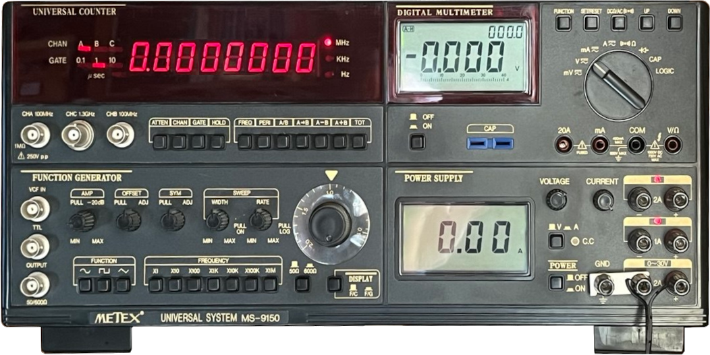

Metex MS-9150 Communication Program
===================================

#### Where ?
Shotcut : You will find the compiled program as .exe file in the [MS-9150/bin/Release folder](MS-9150/bin/Release)

#### What ?
This program communicates with a METEX Universal System.

The software that came originally with the MS-9150 (mine is from 1994) on a [diskette](https://en.wikipedia.org/wiki/Floppy_disk) does not run on modern Windows systems.

I have not found a successor to that software, so I connected an old computer and ran that software 
to see what it does to communicate with the Metex. I then implemented this in this software.

#### How ?
What I found out :
* The Metex *must* be connected with 5 wires: GND, TxD, RxD, DTR and RTS.  
Without the correct signals on DTR and RTS it will not work
* Send a character (the software did send a 'd', but any character seems to do)  
You receive the information on the display of the multimeter
* There is only communication with the multimeter.  
Not with the function generator, frequency counter or power supply

#### Action !
Start the program and it searches for all COM ports on your system and lets you choose one from a dropdown menu.  
You can set the polling interval.  
Then just click 'connect' and hop for the best ;-)  
The settings are stored in the registry, so the next time you start with the same settings.

Have fun with it  
ON7LDS.